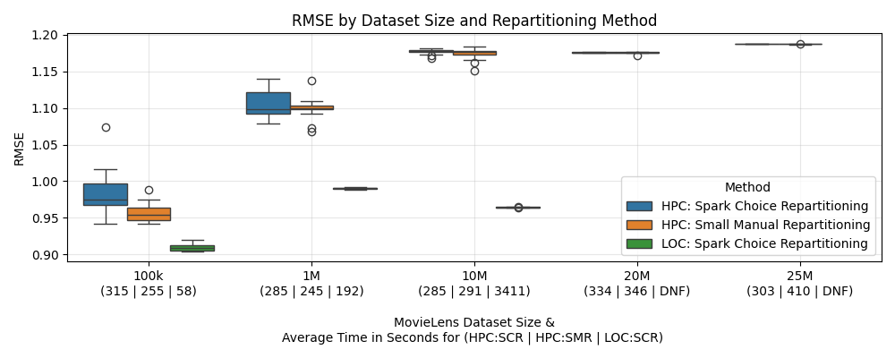

# [LSH-Based Recommender System for MovieLens](https://github.com/Hugoverissimo21/LSH-Recommender)

## Overview

This project implements an item-item collaborative filtering recommender system using Locality-Sensitive Hashing (LSH) to efficiently compute item similarities at scale. The goal is to evaluate performance across different MovieLens dataset sizes, progressing from a clear prototype to a tuned and production-ready implementation.

## Features

- Item-item collaborative filtering using cosine similarity.

- Locality-Sensitive Hashing (LSH) for scalable similarity search.

- Compatible with multiple MovieLens dataset sizes (100K, 1M, 10M+).

- PySpark-based for distributed computation.

- Modular design for tuning and evaluation.

## Methodology and Results

The first step was to download all the MovieLens datasets, which are available in various sizes (100K, 1M, 10M, 20M, and 25M). Not all the datasets were `.csv`, so `pandas` was used to convert them to `.csv` format.

Then, a `prototype.ipynb` was used to create a local prototype using the smallest dataset (100K). This notebook is well-documented and serves as a foundation for understanding the implementation.

Since, the hyperparameters (similarity thresholds, number of hash functions and length of each hash bucket) were empirically chosen, the next step was to perform hyperparameter tuning (`tuning.ipynb`), with the 100K dataset locally, using a partial cross-validation approach to evaluate different configurations. The dataset was split into 10 folds but only 5 passed by the validation step to avoid extensive computation time. The best configuration was selected based on RMSE and execution time.

After this tunning, a `deploy.py` was used to run the optimized version of the recommender system, both locally and on a high-performance computer (HPC), using `spark-submit` and all the MovieLens datasets.

Comparing the results of the local execution with the HPC execution, it was expected that they would be similar, but they were not. The local execution had a much lower RMSE than the HPC execution. Since the code was the same, apart from the Spark initialization (due to RAM, cores, etc.), some hypothesis were made to explain this discrepancy:

- different hash functions between local and HPC executions, leading to different hyperparameter choices

- repartitioning issues on the HPC, where the number of partitions was too high, leading to difficulties in finding neighbors across partitions

These hypothesis were rejected, as HPC performance remained significantly worse than local execution, even after hyperparameter tuning and controlling the number of repartitions on the HPC.

The RMSE and execution times are presented above, between all the datasets and approaches.



It's clear that the local execution performed better than the HPC execution, with a much lower RMSE but a higher execution time, not even being able to finish the 20+M datasets. Besides that, the HPC problem cause remains unidentified and it is also puzzling that executing the 100k dataset takes as long as the 25M dataset.

## Project Structure

1. `prototype.ipynb`<br>Initial implementation notebook with detailed explanations. Developed locally for conceptual validation using the smallest MovieLens dataset (`100k.csv`).

2. `tuning.ipynb`<br>Hyperparameter optimization and performance tuning notebook. Executed using `100k.csv` (local) and `1M.csv` (HPC) to refine similarity thresholds, number of hash functions and length of each hash bucket.

    - `tuningLOC.json`<br>Stores results and evaluation metrics for each tested configuration during local tuning runs.

    - `tuningHPC.json`<br>Stores results and evaluation metrics for each tested configuration during high-performance computing (HPC) runs.

3. `deploy.py`<br>Optimized version for efficient execution. No debug blocks or intermediate visualizations. Suitable for Spark standalone or distributed environments.

    - `deploy.sh`<br>HPC shell script to iterate over all dataset and execute `spark-submit` for each.

    - `deployHPC.csv`<br>Output file containing result metrics generated from the HPC run.

    - `deployHPC/`<br>Directory containing the predicted ratings generated from the HPC run.

    - `deployLOC.csv`<br>Output file containing result metrics generated from the local run.

    - `deployLOC/`<br>Directory containing the predicted ratings generated from the local run.

- `data/` and `assets/`<br>Contain auxiliary files.

**Note:** Code may vary slightly between stages (prototype -> tuning -> deploy), but the core logic remains the same.

## MovieLens Datasets

### MovieLens 100k

- [Download](https://files.grouplens.org/datasets/movielens/ml-latest-small.zip) (1 MB)

- Small: 100,000 ratings and 3,600 tag applications applied to 9,000 movies by 600 users. Last updated 9/2018.

```bash
spark-submit deploy.py data/100k.csv
```       

### MovieLens 1M

- [Download](https://files.grouplens.org/datasets/movielens/ml-1m.zip) (6 MB)

- MovieLens 1M movie ratings. Stable benchmark dataset. 1 million ratings from 6000 users on 4000 movies. Released 2/2003.

```bash
spark-submit deploy.py data/1M.csv
```

### MovieLens 10M

- [Download](https://files.grouplens.org/datasets/movielens/ml-10m.zip) (63 MB)

- MovieLens 10M movie ratings. Stable benchmark dataset. 10 million ratings and 100,000 tag applications applied to 10,000 movies by 72,000 users. Released 1/2009.

```bash
spark-submit deploy.py data/10M.csv
```

### MovieLens 20M

- [Download](https://files.grouplens.org/datasets/movielens/ml-20m.zip) (190 MB)

- MovieLens 20M movie ratings. Stable benchmark dataset. 20 million ratings and 465,000 tag applications applied to 27,000 movies by 138,000 users. Includes tag genome data with 12 million relevance scores across 1,100 tags. Released 4/2015; updated 10/2016 to update links.csv and add tag genome data.

```bash
spark-submit deploy.py data/20M.csv
```

### MovieLens 25M

- [Download](https://files.grouplens.org/datasets/movielens/ml-25m.zip) (250 MB)

- MovieLens 25M movie ratings. Stable benchmark dataset. 25 million ratings and one million tag applications applied to 62,000 movies by 162,000 users. Includes tag genome data with 15 million relevance scores across 1,129 tags. Released 12/2019.

```bash
spark-submit deploy.py data/25M.csv
```